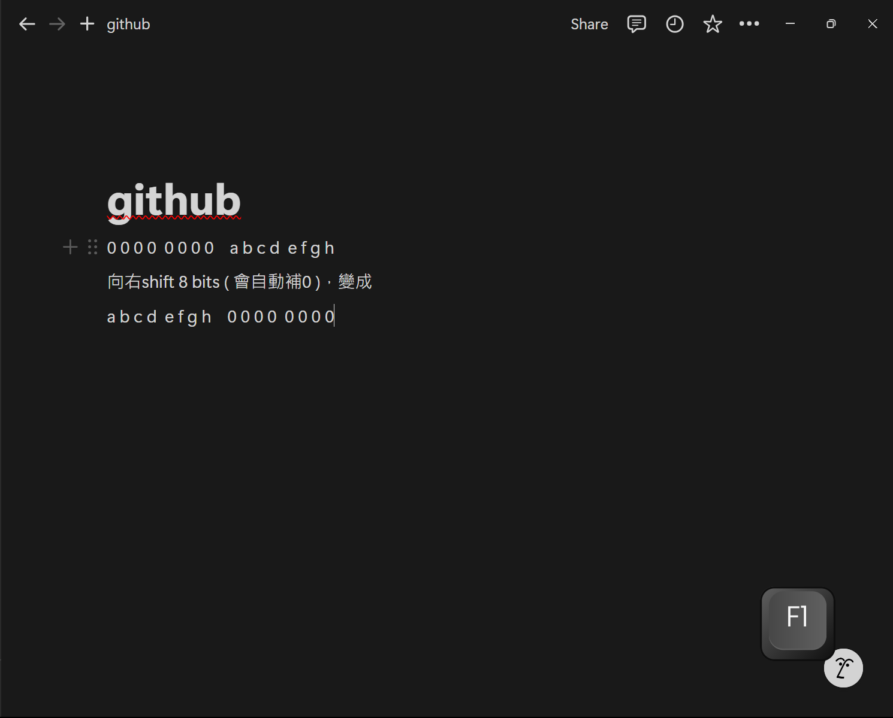
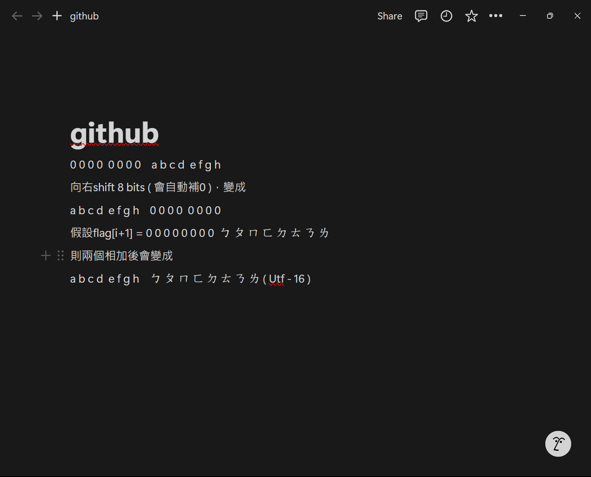
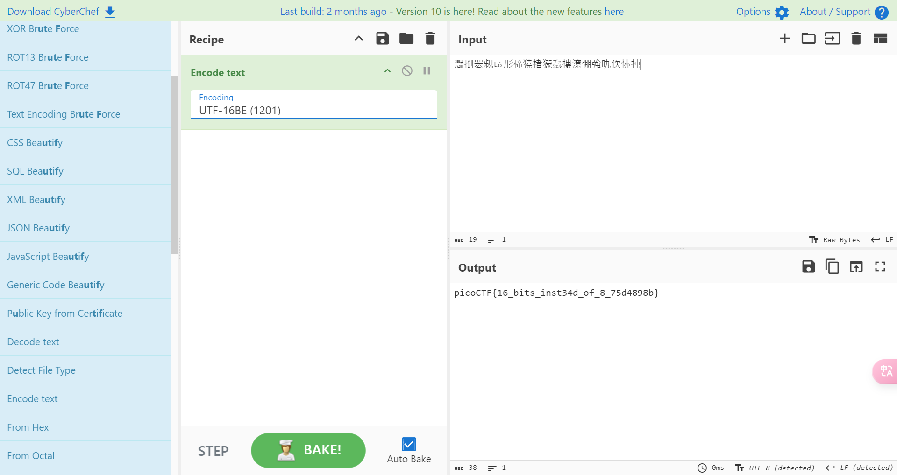
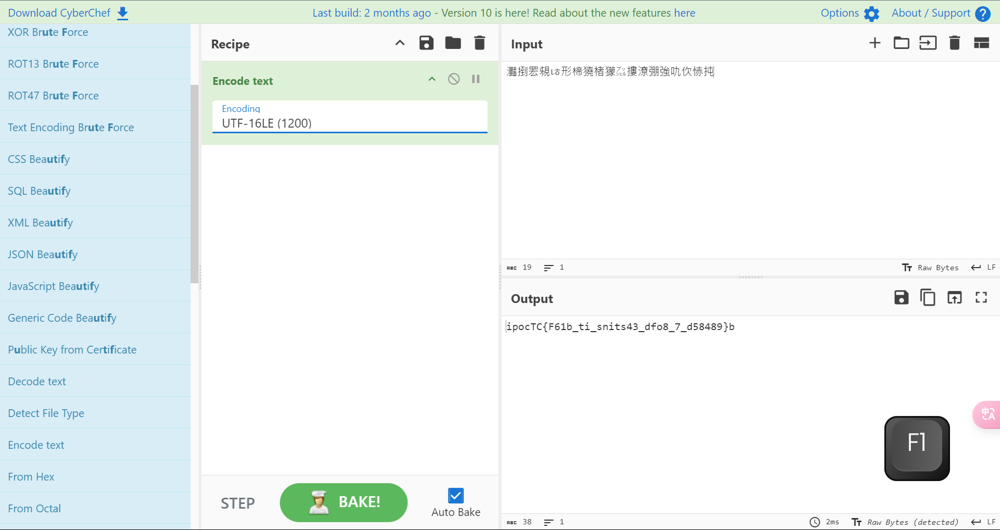

# 題目：Transformation

## Description

I wonder what this really is... [enc](./enc) ''.join([chr((ord(flag[i]) << 8) + ord(flag[i + 1])) for i in range(0, len(flag), 2)])

## Hint

1. You may find some decoders online

## SOLUTION 1

    根據他的提示可以使用線上工具，我使用的是Cyberchef，我們可以先猜開看他是怎麼加密的  
    ''.join([chr((ord(flag[i]) << 8) + ord(flag[i + 1])) for i in range(0, len(flag), 2)])  
    
    1. for i in range(0, len(flag), 2)
    2. chr(ord(flag[i]) << 8
    3. + ord(flag[i + 1]))

第一步：  
    i從0每次跳過一格(0,2,4,6...)到最後(如果len(flag)是偶數的話則跳到倒數第二個字元)  
第二步：  
    把flag[i]變成Unicode並且向右shift 8 bits  
  
第三步：  
    加上上flag[i+1]  
  
    這裡可以知道它變成了UTF-16，所以在Cyberchef上把enc轉換成UTF-16

    那可以再細說一步，後面的BE、LE是什麼意思，這裡是因為要看他是最高有效位(MSB, Most Significant Bit)還是最低有效位(LSB, Most Significant Bit)，是要從前半部往後半部讀，還是由後半部往前半部讀，這會影響到顯示的順序，以下是Utf-16(LE)後的結果


這樣就完成啦!(但其實還有一種方法)

## SOLUTION 2

根據我們剛剛的解析，所以其實可以自己寫一個res.py去做逆向，
這是我的程式碼

```python
for i in enc:
    # 把每一個Utf-16字元 in enc一個一個拿拆解
    print(chr(i)>>8,end='')
    # 這邊是奇數
    # 把(a b c d e f g h  ㄅ ㄆ ㄇ ㄈ ㄉ ㄊ ㄋ ㄌ) >> 8
    # 變(0 0 0 0 0 0 0 0  a b c d e f g h)
    # 會得到UTF-16的左半邊
    print(chr(ord(i)^ord(i)>>8<<8),end='')
    # 這邊是偶數
    # 把  (a b c d e f g h  ㄅ ㄆ ㄇ ㄈ ㄉ ㄊ ㄋ ㄌ) >> 8
    # 變  (0 0 0 0 0 0 0 0  a b c d e f g h) << 8
    # 變  (a b c d e f g h  0 0 0 0 0 0 0 0)
    # 再與(a b c d e f g h  ㄅ ㄆ ㄇ ㄈ ㄉ ㄊ ㄋ ㄌ) 做 XOR
    # 得到(0 0 0 0 0 0 0 0  ㄅ ㄆ ㄇ ㄈ ㄉ ㄊ ㄋ ㄌ)
    # 會得到UTF-16的右半邊

    # 直到全部循環完，就會得到完整的flag啦
```
